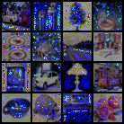
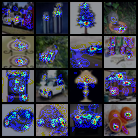
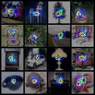
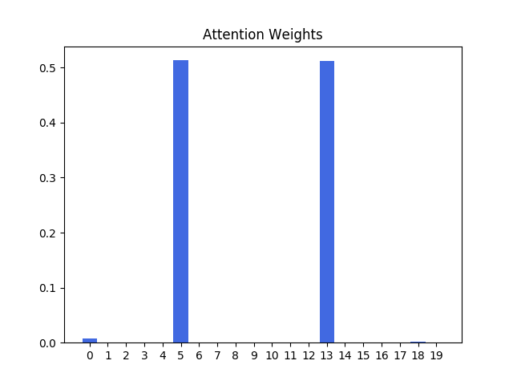

# pytorch-attention-mechanism
my codes for learning attention mechanism

## CNN with attention

*Apply spatial attention to CIFAR100 dataset*

  

### Usage

Train the model:

```bash
$ python cnn-with-attention.py --train
```

Visualize attention map:

```bash
$ python cnn-with-attention.py --visualize
```

## RNN with attention

*Apply temporal attention to sequential data*

*e.g. A sequence of length 20, the output is only related to the 5th position and the 13th position*



### Usage

Train the model:

```bash
$ python rnn-with-attention.py --train
```

Visualize attention map:

```bash
$ python rnn-with-attention.py --visualize
```

## Todos

- [x] CNN+attention
- [x] RNN+attention

## References

- [Learn to Pay Attention! Trainable Visual Attention in CNNs](https://towardsdatascience.com/learn-to-pay-attention-trainable-visual-attention-in-cnns-87e2869f89f1)
- [Attention in Neural Networks and How to Use It](http://akosiorek.github.io/ml/2017/10/14/visual-attention.html)
- [Attention? Attention!](https://lilianweng.github.io/lil-log/2018/06/24/attention-attention.html)
- [Tutorial - Visual Attention for Action Recognition](https://dtransposed.github.io/blog/Action-Recognition-Attention.html)
- [BahdanauAttention与LuongAttention注意力机制简介](https://blog.csdn.net/u010960155/article/details/82853632)
- [目前主流的attention方法都有哪些？](https://www.zhihu.com/question/68482809)

- [Keras Attention Mechanism](https://github.com/philipperemy/keras-attention-mechanism)